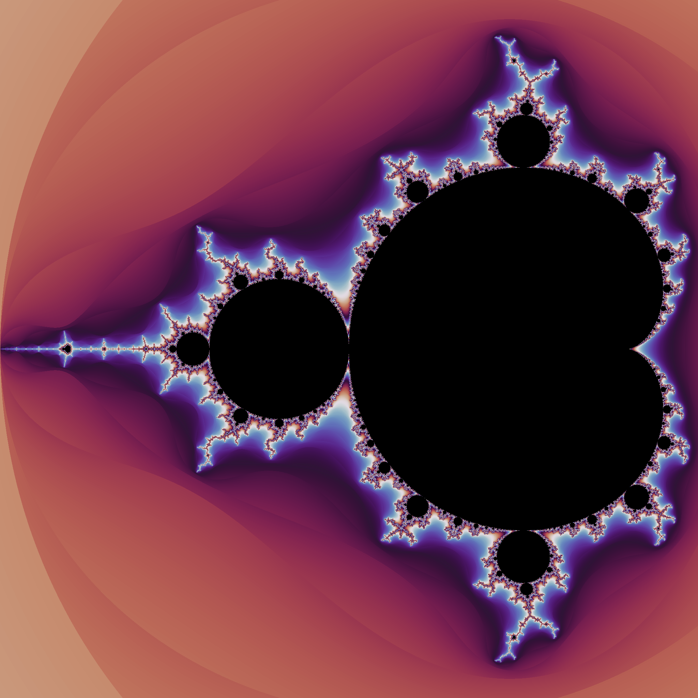
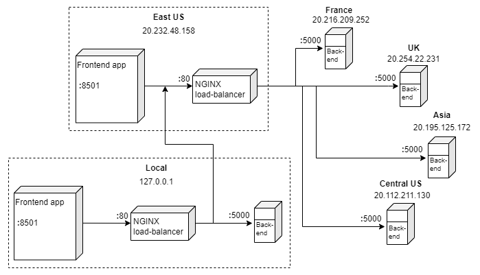

# Distributed Mandelbrot Generator
 
This application is a demonstrator made in Python and Go used to showcase the capability of Docker and NGINX to distribute workloads on several separate servers, by computing the [Mandelbrot set](https://en.wikipedia.org/wiki/Mandelbrot_set).


</img>
</img>
</img>
</img> 

## Installation with Docker

1. From the root folder, run `docker compose build` to create the 3 images of the frontend, the load-balancer and the backend and create the related services. Follow it by `docker compose up`, this command will start all those frontend, load-balancer and backend services.
1.  Once started, the frontend application will be available at the following address: http://localhost:8501.

Note that this particular compose and NGINX configuration create 3 instances of the backend service, each allowed 1 CPU core. Feel free to tweak those parameters to deploy those services in a configuration that fits your needs.

## Usage

Once on the front panel of the application, a user can start by entering the coordinates of the location within the mandelbrot set that he wishes to render. For convenience, a preset of some location are available on the right of the app. 

After the user has chosen a coordinate, he can select the number of iterations that the set will be computed on and the resolution of the output image. A dropdown list of some colormaps is also available. Finnaly, a checkbox enables the computation to be done in chunks that are spread, or load-balanced, over all available backend servers, thus improving computation time.

Once the image is done beeing rendered, the user can download it.

## Architecture

### Frontend

The frontend application was develloped in python using [Streamlit](https://streamlit.io/). It uses a regular form template to upload the parameter set by the user to the backend, which takes care of computing whether a point is within the mandelbrot set, and renders the image returned. When computing the image as chunks, the program sends several asynchronous requests at once, computing and rendering the different parts of the image in parrallel on all available backend servers, also known as "horizontal" scalability.

### Backend

The backend was made in Go, without any external packages, and make use of goroutines to spread the requested computation on all the cpus available to it, spreading the computation "vertically" as much as possible; it is therefore unnecessary to have several instances of the Go service have access to the same hardware.

The computation of whether a point is or isn't in the mandelbrot set is done using the basic following formula: 

$$
z_n = \begin{cases}
			0 &\text{if } n = 1 \\
			z_{n-1}^2 + c &\text{else }
		\end{cases}
$$

If a complex $z$ was found to not be within the set after $n$ iterations, then a color for that point is chosen based on $z$, $n$ and the colormap selected.

The backend API exposes a single path, `/compute`, on which a `POST` request can be made with the following json content:
```
    width:         integer    # Width of the output image in pixels.
    height:        integer    # Height of the output image in pixels.
    max_iteration: integer    # Maximum number of iterations on which the set is computed.
    min_r:         float      # Minimum real value within the set.
    max_r:         float      # Maximum real value within the set.
    min_i:         float      # Minimum imaginary value within the set.
    max_i:         float      # Maximum imaginary value within the set.
    colormap_name: string     # One of BWY, BWR, ICEFIRE, TWILIGHT.
```
The response is a base64 encoded string of the rendered image of the coordinates given.

Note that the same path is used wether the computation is done in chunk or not; the frontend handles chunking the requests and then merging all the response together as a single image.

## Docker container, NGINX load balancing and Azure Container Instances.

For the purpose of the presentation of this application, the frontend and backend have been dockerized and published, using [Azure Container Instance](https://docs.docker.com/cloud/aci-integration/), on several Azure servers spread over the world. The following figure gives an overview of the network that was setup for the presentation (in january 2023).

<p align="center">
  
</p>

The [NGINX](https://www.nginx.com/) load-balancer is configured to use a load-balancing method where a request is passed to the server with the least number of active connections. In this network case, the local load-balancer sets an increased weight to the remote one, equal to the number of remote backend servers.

Since Streamlit is a responsive web framework, the remotely available frontend application can be accessed with a smartphone or tablet as well as a computer.